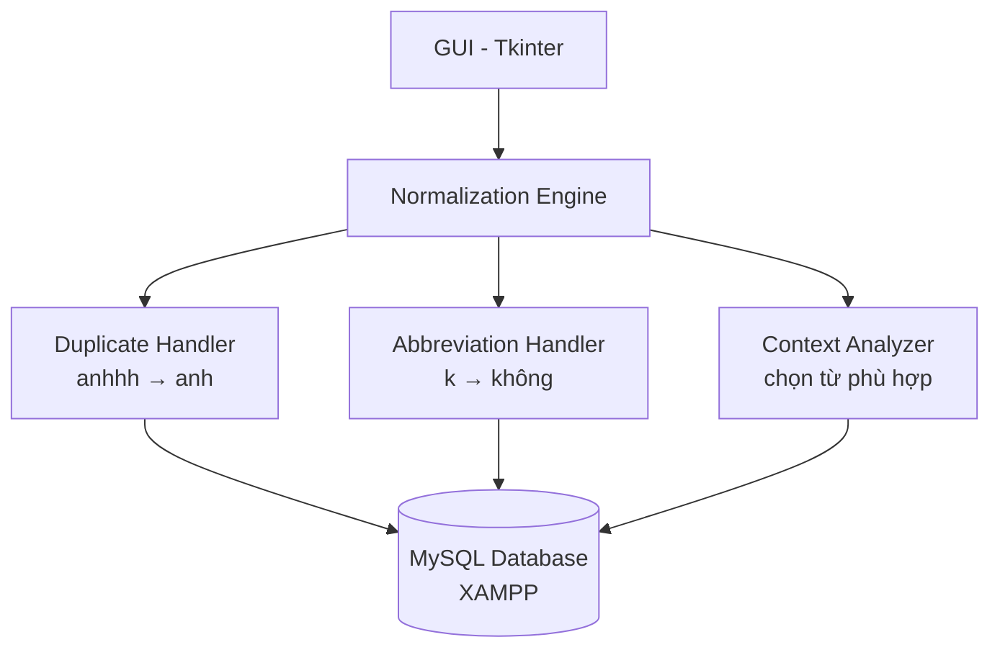

# Ứng dụng Chuẩn hóa Tiếng Việt - Kế hoạch thực hiện

## Mục tiêu
Xây dựng ứng dụng desktop bằng Python + Tkinter giúp chuẩn hóa văn bản tiếng Việt:
- Xử lý **từ lặp ký tự** (anhhh → anh, yeuuu → yeu)
- Xử lý **từ viết tắt** (k → không, dc → được, ns → nói)
- Hiển thị quá trình phân tích trên bảng + code thực tế
- Lưu dữ liệu từ điển vào **MySQL** (XAMPP)

---

## User Review Required

> [!IMPORTANT]
> **Cần cài đặt Python**: Máy hiện chưa có Python. Bạn cần cài Python 3.10+ từ [python.org](https://www.python.org/downloads/) (nhớ tick ✅ "Add Python to PATH").

> [!IMPORTANT]
> **XAMPP MySQL**: Cần XAMPP đang chạy MySQL service trên port mặc định 3306, user `root`, password để trống (default).

---

## Kiến trúc hệ thống



---

## Proposed Changes

### 1. Database MySQL (XAMPP)

#### Database: `vietnamese_normalizer`

**Bảng `vietnamese_words`** — Từ điển tiếng Việt hợp lệ (không dấu):
| Column | Type | Description |
|--------|------|-------------|
| id | INT AUTO_INCREMENT | Primary key |
| word | VARCHAR(50) | Từ không dấu (anh, em, yeu...) |
| word_with_accent | VARCHAR(50) | Từ có dấu (anh, em, yêu...) |
| frequency | INT | Tần suất sử dụng (để chọn từ phổ biến) |
| first_letter | CHAR(5) | Chữ cái đầu (index để tìm nhanh) |

**Bảng `abbreviations`** — Bảng từ viết tắt:
| Column | Type | Description |
|--------|------|-------------|
| id | INT AUTO_INCREMENT | Primary key |
| abbreviation | VARCHAR(20) | Từ viết tắt (k, dc, ns, trc...) |
| full_word | VARCHAR(50) | Từ đầy đủ (không, được, nói, trước...) |
| full_word_accent | VARCHAR(50) | Từ đầy đủ có dấu |
| priority | INT | Độ ưu tiên khi có nhiều lựa chọn |

**Bảng `bigrams`** — Cặp từ đi cùng nhau (để phân tích ngữ cảnh):
| Column | Type | Description |
|--------|------|-------------|
| id | INT AUTO_INCREMENT | Primary key |
| word1 | VARCHAR(50) | Từ thứ nhất |
| word2 | VARCHAR(50) | Từ thứ hai |
| frequency | INT | Tần suất xuất hiện |

---

### 2. Cấu trúc files

#### [NEW] `setup_database.py`
- Script tạo database + tables trong MySQL
- Seed dữ liệu: ~500+ từ tiếng Việt phổ biến không dấu
- Seed ~100+ từ viết tắt teencode phổ biến
- Seed bigrams phổ biến

#### [NEW] `normalizer.py`
- **Class `VietnameseNormalizer`**: Engine xử lý chính
  - `normalize_text(text)`: Hàm chính chuẩn hóa đoạn văn
  - `fix_duplicate_chars(word)`: Xử lý ký tự lặp (anhhh → anh)
  - `fix_abbreviation(word)`: Xử lý từ viết tắt (k → không)
  - `analyze_context(words, index)`: Phân tích ngữ cảnh bằng bigram
  - `get_candidates(word)`: Lấy danh sách từ gợi ý

#### [NEW] `app.py`
- **Giao diện Tkinter** theo wireframe:
  - Frame trên: 2 ô text lớn (trước/sau chuẩn hóa)
  - Frame giữa: Ô code + Bảng phân tích từ (Treeview)
  - Frame dưới: Thống kê (tổng từ + thời gian)
  - Nút "Chuẩn hóa" để kích hoạt xử lý

#### [NEW] `requirements.txt`
- `mysql-connector-python` — kết nối MySQL

---

### 3. Thuật toán chuẩn hóa

```
Input: "anhhh y em"

Bước 1: Tách từ → ["anhhh", "y", "em"]

Bước 2: Xử lý từng từ:
  "anhhh":
    → Phát hiện ký tự lặp (h lặp 3 lần)
    → Thử giảm dần: "anhh" → "anh" → "an" → "a"
    → Tra database: "anh" ✅ tồn tại
    → Candidates: ["anh"]
    
  "y":
    → Tra bảng abbreviations: "y" → ["yêu", "ý"]
    → Phân tích ngữ cảnh: từ trước = "anh", bigram "anh yêu" phổ biến
    → Chọn: "yêu"
    
  "em":
    → Tra database: "em" ✅ tồn tại, không cần sửa

Bước 3: Ghép lại → "anh yêu em"
```

---

### 4. Giao diện (Tkinter)

```
┌──────────────────────────────────────────────────────┐
│              nhập đoạn văn (dưới 50 từ)              │
├────────────────────────┬─────────────────────────────┤
│                        │                             │
│   [Đoạn văn trước     │   [Đoạn văn sau             │
│    khi chỉnh hóa]     │    khi chỉnh hóa]           │
│                        │                             │
├────────────────────────┤                             │
│   [Nút CHUẨN HÓA]     │                             │
├────────────────────────┼─────────────────────────────┤
│                        │ ┌─────┬─────┬─────┐        │
│   [Code xử lý         │ │anhhh│  y  │ em  │ ← gốc  │
│    nghiệp vụ          │ ├─────┼─────┼─────┤        │
│    hiển thị ở đây]     │ │ anh │ yeu │ em  │ ← chọn │
│                        │ └─────┴─────┴─────┘        │
├────────────────────────┴─────────────────────────────┤
│  Tổng số từ: 3  |  Thời gian xử lý: 0.000001s       │
└──────────────────────────────────────────────────────┘
```

---

## Open Questions

> [!IMPORTANT]
> 1. **MySQL password**: XAMPP MySQL của bạn dùng password gì? Mặc định là `root` không password đúng không?

> [!IMPORTANT]
> 2. **Port MySQL**: XAMPP MySQL chạy port mặc định `3306` đúng không?

> [!WARNING]
> 3. **Từ viết tắt**: Bạn muốn tôi thêm bao nhiêu từ viết tắt? Tôi sẽ thêm ~100 từ viết tắt phổ biến nhất (k, dc, ns, trc, mk, bn, j, gì, đc, ko, kg...). Bạn có muốn bổ sung thêm từ nào cụ thể không?

---

## Verification Plan

### Automated Tests
- Chạy `setup_database.py` → kiểm tra database được tạo thành công
- Chạy `app.py` → giao diện hiển thị đúng layout
- Test case: "anhhh y em" → "anh yêu em"
- Test case: "toi k biet dc" → "tôi không biết được"

### Manual Verification
- Bạn kiểm tra giao diện trực quan
- Thử nhập nhiều câu khác nhau để test
